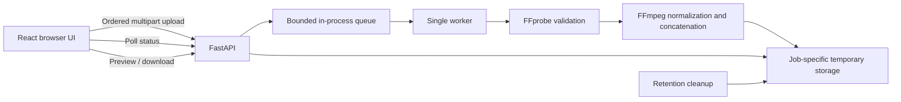

# ReelWeave

**Turn your clips into one story.**

ReelWeave is a local video-merging web application and the application layer of
DevOps portfolio Project 3. Select clips, arrange them, and merge them into an MP4
with FFmpeg. It uses no paid APIs or external video-processing services.

[Verification results and executed commands](docs/verification.md) ·
[Desktop screenshot](docs/screenshots/desktop-arranged.png) ·
[Mobile result screenshot](docs/screenshots/mobile-result.png)

## What it does

- Select or drop MP4, MOV, WebM, and MKV clips; files stay in your browser until you press Merge.
- Arrange 2–20 clips with drag-and-drop or keyboard-accessible move buttons.
- See file names, sizes, order, and duration when your browser can read the metadata.
- Trim every clip with inclusive frame handles, exact frame/timestamp readouts,
  a playhead, and one-frame previous/next controls.
- Slow each clip to 0.75x or 0.5x after trimming.
- Add one MP3, WAV, AAC, or M4A background track, set original/music volume,
  and mute either track. Short music loops; long music ends with the video.
- Merge different resolutions, frame rates, codecs, and clips without audio.
- Follow real job states, preview the output, and download an H.264/AAC MP4.
- Remove temporary files automatically after a configurable retention period.

## Architecture



The frontend uses React, TypeScript, Vite, and CSS. The backend uses FastAPI and
Python subprocess argument lists; uploaded names never become storage paths or
shell commands. Every merge gets a generated UUID and its own files. One worker
processes queued jobs sequentially to limit CPU use. No database is required.

## Folder structure

```text
ReelWeave/
├── frontend/              React app, Vitest tests, npm lockfile
│   └── src/
│       ├── components/    Upload, clip list, summary and result UI
│       └── lib/           API and clip utilities
├── backend/               FastAPI application and pip requirements
│   └── app/               Configuration, routes, jobs, storage and FFmpeg
├── tests/
│   ├── backend/           API, storage, jobs and subprocess tests
│   └── integration/       Actual FFmpeg merge test
├── docs/                  Approved design, plan and verification record
├── pyproject.toml         Pytest and Ruff configuration
├── .gitignore
└── README.md
```

## Prerequisites

- Python 3.10 or newer, with pip and venv.
- Node.js 22.12+ (Node 24 also works) and npm.
- FFmpeg and FFprobe on PATH, with the `libx264` video encoder and `aac` audio encoder.
- Several GB of free working space; uploaded, normalized and final videos coexist during processing.

Installation commands below are for you to run. The project does not install
system software, change PATH, create cloud resources or deploy anything.

### FFmpeg on Windows

Download a Windows build linked from the [official FFmpeg download page](https://ffmpeg.org/download.html).
Extract it to a folder such as `C:\ffmpeg`. Either add its `bin` directory to PATH
yourself, or configure absolute executable paths in `backend/.env`. Both
`ffmpeg.exe` and `ffprobe.exe` are needed.

### FFmpeg on Ubuntu

```bash
sudo apt update
sudo apt install ffmpeg python3-venv
```

### FFmpeg on macOS

With Homebrew already installed:

```bash
brew install ffmpeg
```

Verify before starting:

```text
ffmpeg -version
ffprobe -version
```

The health endpoint also reports executable availability. FFmpeg without the
required encoders may pass the executable check but fail a merge; check
`ffmpeg -encoders` if your distribution provides a reduced build.

## Local setup and startup

Run commands from the ReelWeave project root unless a `cd` says otherwise.
All Python dependencies go into a project-local virtual environment. The frontend
dependencies stay in `frontend/node_modules`.

### Windows PowerShell: backend

```powershell
python -m venv .venv
.\.venv\Scripts\python.exe -m pip install -r backend/requirements-dev.txt
Copy-Item backend/.env.example backend/.env
.\.venv\Scripts\python.exe -m uvicorn backend.app.main:app --host 127.0.0.1 --port 8000
```

Using the virtual environment's Python directly avoids changing PowerShell's
execution policy. `requirements-dev.txt` includes runtime and test/lint tools;
use `requirements.txt` when you only need the runtime.

### macOS / Ubuntu: backend

```bash
python3 -m venv .venv
.venv/bin/python -m pip install -r backend/requirements-dev.txt
cp backend/.env.example backend/.env
.venv/bin/python -m uvicorn backend.app.main:app --host 127.0.0.1 --port 8000
```

### Frontend: second terminal

```powershell
cd frontend
npm.cmd ci
Copy-Item .env.example .env
npm.cmd run dev
```

On macOS/Linux use `npm` instead of `npm.cmd` and `cp` instead of `Copy-Item`.
Open **http://127.0.0.1:5173**. Vite forwards `/api` to
`http://127.0.0.1:8000`. Keep both terminals running.

API docs: **http://127.0.0.1:8000/docs**. OpenAPI schema:
**http://127.0.0.1:8000/openapi.json**.

### Use the app

1. Select at least two videos. Unsupported or oversized selections produce an error.
2. Put them in order using the drag handles or move-up/move-down buttons.
3. Use **Trim** to choose inclusive source frames and use **Speed** for each clip.
4. Optionally choose one background-audio file and adjust the two audio tracks.
5. Press **Merge clips**. Files upload only now.
6. Keep the tab open while the job is queued or processing, then preview or download the MP4.
7. Press **Start new merge** to clear the browser selection. Retention cleanup handles the old job.

## Environment configuration

The backend loads `backend/.env` when launched from the project root. Existing
process environment variables take precedence. Copy the example once, then edit
your `.env`; do not replace an existing configuration when updating the project.
Relative storage paths resolve from the current working directory.

| Variable | Default | Purpose |
|---|---|---|
| `REELWEAVE_WORKING_ROOT` | `./var/reelweave` | Dedicated root for application temporary data |
| `REELWEAVE_UPLOAD_ROOT` | `<working root>/uploads` | Job-specific uploaded sources |
| `REELWEAVE_OUTPUT_ROOT` | `<working root>/outputs` | Job-specific downloadable results |
| `REELWEAVE_MAX_FILE_SIZE_MB` | `200` | Per-file limit in MiB (1,048,576 bytes), displayed as MB in the UI |
| `REELWEAVE_MAX_AUDIO_FILE_SIZE_MB` | `100` | Background-audio limit in MiB |
| `REELWEAVE_MAX_CLIPS` | `10` | Maximum files in a merge; minimum is two |
| `REELWEAVE_QUEUE_SIZE` | `4` | Bounded pending-job capacity; one worker processes jobs |
| `REELWEAVE_RETENTION_SECONDS` | `3600` | Retention period for terminal jobs |
| `REELWEAVE_CLEANUP_INTERVAL_SECONDS` | `300` | Cleanup scan interval |
| `REELWEAVE_ALLOWED_ORIGINS` | `http://localhost:5173` | Comma-separated frontend origins for CORS |
| `REELWEAVE_FFMPEG_PATH` | `ffmpeg` | Executable name or absolute FFmpeg path |
| `REELWEAVE_FFPROBE_PATH` | `ffprobe` | Executable name or absolute FFprobe path |
| `REELWEAVE_SUBPROCESS_TIMEOUT_SECONDS` | `1800` | Timeout for each processing command |

All upload/output directories must be distinct, non-overlapping descendants of
the dedicated working root. Intermediate files live in `<working root>/intermediate`.
Do not point these directories at folders containing personal files. When changing
the working root in the example configuration, change the explicit upload/output
paths too, or remove those two overrides so the backend derives them.

Example Windows executable overrides (forward slashes work):

```dotenv
REELWEAVE_FFMPEG_PATH=C:/ffmpeg/bin/ffmpeg.exe
REELWEAVE_FFPROBE_PATH=C:/ffmpeg/bin/ffprobe.exe
REELWEAVE_ALLOWED_ORIGINS=http://localhost:5173,http://127.0.0.1:5173
```

The frontend loads `frontend/.env` through Vite. Leave `VITE_API_BASE_URL` empty for
the development proxy. To serve the frontend separately, set it to the backend's
origin, such as `http://127.0.0.1:8000`, and include the actual frontend origin in
the backend's CORS configuration. Restart Vite after configuration changes;
`VITE_*` values are public and embedded at build time, so never put secrets there.

## Tests, formatting and production build

From the project root in PowerShell:

```powershell
.\.venv\Scripts\python.exe -m pytest tests/backend
.\.venv\Scripts\python.exe -m ruff check backend tests
.\.venv\Scripts\python.exe -m ruff format --check backend tests
$env:RUN_FFMPEG_TESTS = '1'
.\.venv\Scripts\python.exe -m pytest tests/integration
```

The integration tests first verify FFmpeg/FFprobe, generate small real clips, and
test mixed-format output, ordering, video/audio codecs, range playback, download,
deletion and corrupted-video failure. Without `RUN_FFMPEG_TESTS=1` these expensive
tests are explicitly skipped; unit tests mock subprocess execution. To run on
macOS/Linux, replace the Python path with `.venv/bin/python` and use
`RUN_FFMPEG_TESTS=1 .venv/bin/python -m pytest tests/integration`.

In the frontend directory:

```powershell
npm.cmd test
npm.cmd run lint
npm.cmd run format:check
npm.cmd run build
npm.cmd run test:e2e
```

The browser test uses an **already installed Microsoft Edge**, starts local Vite
and FastAPI servers, and exercises selection, ordering, real merging, playback,
download and reset at desktop/mobile viewport sizes. It requires the backend
virtual environment and FFmpeg. To use an installed Chrome instead, set
`$env:PLAYWRIGHT_CHANNEL = 'chrome'` before the command. It writes screenshots in
`docs/screenshots` and temporary test files under the ignored test-results/var
directories. It does not install a browser or deploy anything.

Use `npm.cmd run format` and `.\.venv\Scripts\python.exe -m ruff format backend tests`
to apply formatting. `npm.cmd run build` emits static assets in `frontend/dist`.
`npm.cmd run preview` previews that build locally; configure `VITE_API_BASE_URL`
and CORS when the frontend is served without the development proxy.

## Temporary-file cleanup

Each job has generated UUID directories for sources, normalized clips, and output.
The worker records completion/failure time. Terminal jobs expire after the
configured retention period (60 minutes by default); the periodic scan removes
their files and registry entries. Actual deletion can occur up to one scan
interval after expiry. Active uploads and queued/processing jobs are protected.

Startup and periodic orphan scans handle generated job directories left behind
by a previous process. Orphans use directory modification time because their
in-memory timestamps no longer exist. Cleanup checks storage confinement, refuses
path escapes and symlinks, and ignores unrelated entries. Files locked by Windows
are retained for a later retry. `DELETE /api/jobs/{id}` lets you remove a completed
or failed job immediately; active jobs return 409.

Use a dedicated, private working directory. A backend restart makes old job IDs
unavailable immediately, even when orphaned files have not yet expired. The
**Start new merge** button resets browser state; it does not cancel or delete an
existing backend job.

## API endpoints

| Method | Endpoint | Behavior |
|---|---|---|
| GET | `/api/health` | API status, FFmpeg/FFprobe availability, upload limits |
| POST | `/api/merge` | Ordered `files`, required JSON `manifest`, optional `background_audio`; returns HTTP 202 |
| GET | `/api/jobs/{job_id}` | Current job state and a friendly failure message |
| GET | `/api/jobs/{job_id}/video` | Inline MP4 for HTML5 playback |
| GET | `/api/jobs/{job_id}/download` | Attachment with a safe generated filename |
| DELETE | `/api/jobs/{job_id}` | Deletes a terminal job and its files; active jobs return 409 |

Job states are `queued`, `processing`, `completed`, and `failed`. The UI also
shows `Uploading` while the POST is in flight; it does not invent percentages.

```json
{
  "job_id": "f2cb406c-a2bd-405a-9233-760720572de7",
  "status": "queued",
  "error": null
}
```

The multipart `manifest` keeps its clip catalog in the same order as the
repeated `files` parts. `order` must contain every catalog `client_id` exactly
once and controls the sequential Video 1 render order. `output_fps` must be
`24`, `25`, `30`, `50`, or `60`. Frame ranges are zero-based and inclusive.
`trim_saved` is `false` for the browser-generated full-clip default and becomes
`true` after the user saves a trim.

```json
{
  "output_fps": 25,
  "order": ["browser-id-b", "browser-id-a"],
  "clips": [
    {
      "client_id": "browser-id-a",
      "start_frame": 0,
      "end_frame": 89,
      "speed": 0.75,
      "trim_saved": false
    },
    {
      "client_id": "browser-id-b",
      "start_frame": 12,
      "end_frame": 47,
      "speed": 1,
      "trim_saved": true
    }
  ],
  "audio": {
    "original_volume": 1,
    "original_muted": false,
    "music_volume": 0.3,
    "music_muted": false
  }
}
```

The timeline action renders only real uploaded Video 1 clips through the same
merge job, preview, and download endpoints. Sample storyboard cards, Video 2
overlays, visual-only multi-track controls, and MOV output are not rendered.

FFprobe's decoded frame count is authoritative. The backend replaces an
unsaved default with the full decoded range and clamps a stale end frame to the
actual final frame. A saved trim is rejected only when no selected frames
remain after that clamp.

Errors have a consistent JSON envelope:

```json
{
  "error": {
    "code": "invalid_job_id",
    "message": "The job ID is invalid."
  }
}
```

Malformed job IDs are rejected; unknown, expired, deleted and pre-restart jobs
are not available. Size limits return 413, unsupported formats return 415, invalid
counts return 422, and missing processing tools or a full queue return 503.
Corrupted or unreadable media is rejected with a structured 422 response before
the job is queued. Technical diagnostics belong in backend logs, not API responses.

## Video output

ReelWeave trims selected source frames first, applies per-clip speed second,
concatenates third, and mixes optional music last.

The MVP produces 1280×720 video at 30 fps with H.264, yuv420p and 48 kHz stereo AAC.
Normalization preserves the displayed aspect ratio and pads unused space. Portrait
clips therefore have bars on the sides. Audio is padded to the video length;
silent clips get a silent track. Original metadata, subtitles and extra tracks
are not retained. Clips are joined with straight cuts in the submitted order.

Normalization intentionally re-encodes video for compatibility, so quality and
file size may differ from the originals. Processing speed depends on clip length,
resolution, codecs, CPU and available storage.

The final join also re-encodes to enforce a constant frame rate across clip
boundaries. This adds processing time but avoids timing gaps from simply copying
separately encoded video/audio segments into one container.

## Known MVP limitations

- Intended for trusted local use, bound to loopback. There is no authentication,
  per-user isolation, distributed queue, public-service abuse protection or database.
- Run **one Uvicorn worker**. Multiple processes would have separate job registries.
- Jobs are kept in memory. Restarting loses status and access to previous results;
  orphaned files remain eligible for retention cleanup.
- Browser metadata and thumbnail support varies for MKV, MOV and some codecs.
  A missing duration or thumbnail does not necessarily mean FFmpeg cannot read it.
- Refreshing or closing the page loses the browser's selected files and UI state.
  An already accepted backend job can continue until completion or shutdown.
- File size, clip count, queue length and subprocess timeouts bound some resources;
  they are not a substitute for quotas and isolation in a future public deployment.
- No transitions, authentication, saved projects, payments, AI features or cloud storage.
- Format normalization uses a fixed output profile; no user-selectable export settings.
- Keep temporary storage on a local disk outside sync folders when using large media.

## Future DevOps roadmap — not implemented

1. **GitHub:** establish the repository, protected branches, reviews and release tags.
2. **Docker:** package frontend/backend/FFmpeg, use non-root runtime users and resource limits.
3. **Jenkins CI/CD:** run tests/builds and promote immutable image versions.
4. **SonarQube:** add code quality checks and maintainability gates.
5. **Trivy:** scan dependencies and container images before publishing.
6. **AWS ECR:** store tagged container images for controlled deployment.
7. **Kubernetes:** deploy with health probes, persistent/ephemeral storage design and job resource controls.
8. **Nginx Ingress:** route frontend/API traffic and configure suitable upload limits and timeouts.
9. **AWS S3:** move uploads/results to private object storage with lifecycle policies and signed URLs.
10. **Prometheus and Grafana:** monitor queue depth, job failures, latency, CPU and storage.
11. **Loki and Promtail:** aggregate structured logs and correlate events by job ID.
12. **Domain and HTTPS:** configure DNS, certificates and secure transport.
13. **Rollback strategy:** retain previous immutable images, version configuration, verify health after
    rollout and roll back to the last known-good release on failed smoke tests.

## Technical references

- [FastAPI file uploads](https://fastapi.tiangolo.com/tutorial/request-files/)
- [FFmpeg filters: scaling, padding and audio normalization](https://ffmpeg.org/ffmpeg-filters.html)
- [Vite setup and Node requirements](https://vite.dev/guide/)
